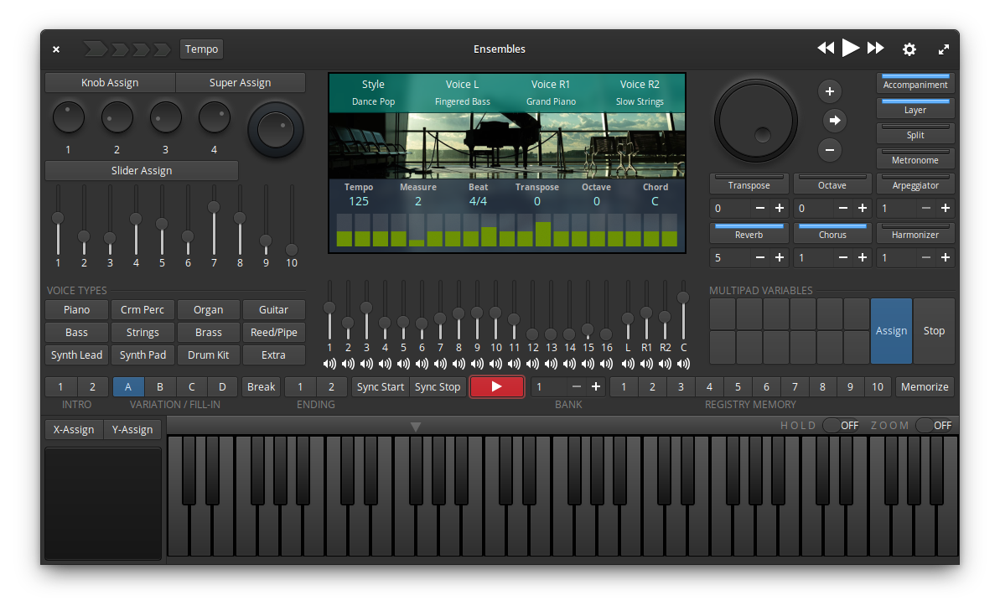

<div align="center">
  <div align="center">
    
  </div>
  <hr>
  <div align="center">
    <b>Musical Performance Arranger Workstation</b>
    <br>
    
  </div>
  <br>
  Ensembles is a realtime musical performance arranger app. Its built using Vala and Gtk, powered by Fluidsynth. Ensembles is different from other DAW (Digital Audio Workstations) in the fact that the focus here is on live performance (although it can record performance? Why not?).
</div>

<br>

## The main features:

* Play any instrument from a selection of more than 200 in-built voices
* 60-Key on-screen keyboard with mouse and touch support
* Split Keyboard or Layer two voices for multiple voice playback
* DSP (Digital Signal Processing) effects like filters, reverb and chorus
* Assign knobs and sliders to multiple DSP effects along with a Master Knob which can be used to control multiple knobs and sliders
* Touch based on-screen assignable joystick
* Play a one-man-band along with a Auto Accompaniment Style from over 100 [WIP] built-in styles based on various genres of music
* Automate your band with Registration Memory and 12 assignable Multipad Variables
* Record your playback using Sequencer with 8-Track recording (in future)
* Record your playback into MP3 audio (in future)
* Connect to external MIDI keyboard/controller with General MIDI Standard compatibility

⚠️ **Ensembles is in early development and not ready for production just yet** ⚠️

However, feel free to test it early
## Get it on elementary OS Appcenter
TBD
<!-- [](https://appcenter.elementary.io/) -->

## Install from source
You can install Ensembles by compiling it from source, here's a list of required dependencies:
 - `gtk+-3.0>=3.18`
 - `granite>=5.3.0`
 - `glib-2.0`
 - `gobject-2.0`
 - `meson`
 - `libhandy-1`
 - `fluidsynth>=2.2.1`
 - `portmidi`

Clone repository and change directory
```
git clone https://github.com/SubhadeepJasu/ensembles.git
cd ensembles
```
Compile, install using meson and start Ensembles on your system *(Requires GIT-LFS)*
```
meson _build --prefix=/usr
cd _build
sudo ninja install
com.github.subhadeepjasu.ensembles
```

... _OR_ as flatpak *(Does not require GIT-LFS)*
```
flatpak-builder build  com.github.subhadeepjasu.ensembles.yml --user --install --force-clean
flatpak run com.github.subhadeepjasu.ensembles

```

## Realtime Audio Performance
The software does require quiet a lot of CPU power. If you notice bad delay or stuttering audio, launch the app from terminal; check to see if there is any error messages stating that fluidsynth was unable to set realtime priority. In that case, edit the file- `/etc/security/limits.conf` and add the following lines:
```
@audio   -  rtprio      90
@audio   -  memlock     unlimited
```

The problem currently usually happens with the flatpak version.

## Discussions
If you want to ask any questions or provide feedback, you can make issues in this repository

## Contributing
Feel free to send pull requests to this repository with your code, or other types of assets like soundfont voices, style files, etc. Soundfont in this repo is no longer updated and its available in a different repository https://gitlab.com/SubhadeepJasu/ensemblesgmsoundfont due to LFS concerns.

## Plug-In Development
Ensembles will have support for sampled voice, voice synthesis and DSP plug-ins. Plug-ins may support their own UI which can be accessed from within Ensembles. You can create plug-ins and distribute them over Flathub or elementary OS AppCenter.

## External Files
Ensembles supports creation and distribution of external soundfonts (SF2), style files and MIDI recordings. External content can be placed in special folders in user's document folder. Style files from other formats like *STY*,  *AC7*, etc. are not compatible with Ensembles. Ensembles has its own style format *ENSTL*, check out styles Readme file in your documents folder for style specifications. External MIDI recordings may have reserved copyrights.

<br>
<sup><b>License</b>: GNU GPLv3</sup>
<br>
<sup>Certain components like soundfonts and styles have their own Licensing</sup>
<br>
<sup>© Copyright 2021-2022 Subhadeep Jasu</sup>
