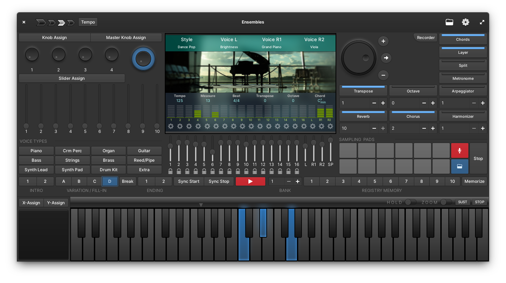

<div align="center">
  <div align="center">
    
  </div>
  <hr>
  <div align="center">
    <b>Musical Performance Arranger Workstation</b>
    <br>
    
  </div>
  <br>
</div>
Ensembles is a realtime musical performance arranger app. Its built using Vala and Gtk, powered by Fluidsynth. Ensembles is different from other DAW (Digital Audio Workstations) in the fact that the focus here is on live performance.


<!-- ALL-CONTRIBUTORS-BADGE:START - Do not remove or modify this section -->
[](#contributors-)
<!-- ALL-CONTRIBUTORS-BADGE:END -->

<br>

## The main features:

* Play any instrument from a selection of more than 200 in-built voices
* 60-Key on-screen keyboard with mouse and touch support
* Split Keyboard or Layer two voices for multiple voice playback
* DSP (Digital Signal Processing) effects like filters, reverb and chorus
* Assign knobs and sliders to multiple DSP effects along with a Master Knob which can be used to control multiple knobs and sliders
* Touch based on-screen assignable joystick
* Play a one-person band along with a Auto Accompaniment Style from over 100 [WIP] built-in styles based on various genres of music
* Automate your band with Registration Memory
* Record and play audio files using 12 assignable Sampling Pads
* Record your playback in a multitrack recorder (10 tracks)
* Play MIDI files using the inbuilt synthesizer
* Connect to external MIDI keyboard/controller with General MIDI Standard compatibility

⚠️ **Ensembles is in early development and not ready for production just yet** ⚠️

However, feel free to test it early
## Get it on elementary OS Appcenter
[](https://appcenter.elementary.io/com.github.subhadeepjasu.ensembles/)

## Install from source
You can install Ensembles by compiling it from source, here's a list of required dependencies:
 - `io.elementary.Platform>=6` (flatpak)
 - `io.elementary.Sdk>=6` (flatpak)
 - `elementary-sdk`
 - `gtk+-3.0>=3.24`
 - `granite>=6.1.2`
 - `glib-2.0`
 - `gobject-2.0`
 - `meson`
 - `libhandy-1>=1.2`
 - `json-glib-1.0>=1.4.4`
 - `lv2`
 - `lilv-0`
 - `suil-0`
 - `fluidsynth>=2.2.1`
 - `portmidi`

**Clone repository and change directory**
```
git clone https://github.com/SubhadeepJasu/ensembles.git
cd ensembles
```

**Compile, install using flatpak and start Ensembles on your system** *(Recommended)*
```
flatpak-builder build  com.github.subhadeepjasu.ensembles.yml --user --install --force-clean
flatpak run com.github.subhadeepjasu.ensembles

```
**_OR_ using meson** *(Requires GIT-LFS)*

```
meson _build --prefix=/usr
cd _build
sudo ninja install
com.github.subhadeepjasu.ensembles
```
Don't forget to also install the soundfont from https://gitlab.com/SubhadeepJasu/ensemblesgmsoundfont, if you are doing meson build

## Realtime Audio Performance
You can tweak audio settings in Ensembles and select one of the two drivers (**Alsa** or **PulseAudio**). Increasing buffer size will reduce system load but too much increase in buffer-size may also cause sounds to go out of sync. So, feel free to tinker a little until you find your sweet spot in terms of performance.

Even after all that, while using **PulseAudio**, if you notice bad delay or stuttering audio, launch the app from terminal; check to see if there is any error messages stating that fluidsynth was unable to set realtime priority. In that case, edit the file- `/etc/security/limits.conf` and add the following lines:
```
@audio   -  rtprio      90
@audio   -  memlock     unlimited
```

The problem currently usually happens with the flatpak version.

**PipeWire** support is planned and Ensembles will detect if you have it installed and it will modify the PulseAudio driver settings internally to better utilise PipeWire-Pulse if that is available.

**Jack** is also an option but it currently only works from outside the flatpak soundbox, ie. when you compile it natively.

## Discussions
If you want to ask any questions or provide feedback, you can make issues in this repository or use the discussions section of this repository.

## Contributing
Feel free to send pull requests to this repository with your code, or other types of assets like soundfont voices, style files, etc. Soundfont in this repo is no longer updated and its available in a different repository https://gitlab.com/SubhadeepJasu/ensemblesgmsoundfont due to LFS concerns.

## Plug-In Development
Ensembles will have support for effects and instrument plug-ins. Plug-ins may support their own UI which can be accessed from within Ensembles. There is partial support for LV2 plug-ins and it will be while before that is fleshed out properly. You can create plug-ins and distribute them over Flathub or elementary OS AppCenter, provided they follow the usual standards.

## External Files
Ensembles supports creation and distribution of external soundfonts (SF2), style files and MIDI recordings. External content can be placed in special folders in user's document folder. Style files from other formats like *STY*,  *AC7*, etc. are not compatible with Ensembles. Ensembles has its own style format *ENSTL*, check out styles Readme file in your documents folder for style specifications (Check: https://github.com/SubhadeepJasu/Ensembles/blob/master/data/Styles/README.md). External MIDI recordings may have reserved copyrights.


## Contributors
Thanks goes to these wonderful people ([emoji key](https://allcontributors.org/docs/en/emoji-key)):

<!-- ALL-CONTRIBUTORS-LIST:START - Do not remove or modify this section -->
<!-- prettier-ignore-start -->
<!-- markdownlint-disable -->
<table>
  <tr>
    <td align="center"><a href="http://subhadeepjasu.github.io"><br /><sub><b>Subhadeep Jasu</b></sub></a><br /><a href="#design-SubhadeepJasu" title="Design">🎨</a> <a href="https://github.com/SubhadeepJasu/Ensembles/commits?author=SubhadeepJasu" title="Code">💻</a> <a href="https://github.com/SubhadeepJasu/Ensembles/commits?author=SubhadeepJasu" title="Documentation">📖</a></td>
    <td align="center"><a href="https://ryonakano.github.io"><br /><sub><b>Ryo Nakano</b></sub></a><br /><a href="https://github.com/SubhadeepJasu/Ensembles/commits?author=ryonakano" title="Code">💻</a></td>
    <td align="center"><a href="https://proseandconst.xyz/"><br /><sub><b>Darshak Parikh</b></sub></a><br /><a href="https://github.com/SubhadeepJasu/Ensembles/commits?author=dar5hak" title="Code">💻</a> <a href="https://github.com/SubhadeepJasu/Ensembles/commits?author=dar5hak" title="Documentation">📖</a></td>
    <td align="center"><a href="https://micahilbery.com/"><br /><sub><b>Micah Ilbery</b></sub></a><br /><a href="#design-micahilbery" title="Design">🎨</a></td>
    <td align="center"><a href="https://github.com/Newbytee"><br /><sub><b>Newbyte</b></sub></a><br /><a href="https://github.com/SubhadeepJasu/Ensembles/commits?author=Newbytee" title="Documentation">📖</a></td>
    <td align="center"><a href="https://digital.hedronmx.com/"><br /><sub><b>Hedron Digital</b></sub></a><br /><a href="#userTesting-Hedronmx" title="User Testing">📓</a></td>
    <td align="center"><a href="https://github.com/benpocalypse"><br /><sub><b>benpocalypse</b></sub></a><br /><a href="#userTesting-benpocalypse" title="User Testing">📓</a></td>
  </tr>
  <tr>
    <td align="center"><a href="https://github.com/NathanBnm"><br /><sub><b>Nathan Bonnemains</b></sub></a><br /><a href="https://github.com/SubhadeepJasu/Ensembles/commits?author=NathanBnm" title="Code">💻</a> <a href="#translation-NathanBnm" title="Translation">🌍</a></td>
  </tr>
</table>

<!-- markdownlint-restore -->
<!-- prettier-ignore-end -->

<!-- ALL-CONTRIBUTORS-LIST:END -->

This project follows the [all-contributors](https://github.com/all-contributors/all-contributors) specification. Contributions of any kind welcome!
<br>
<hr>
<br>
<sup><b>License</b>: GNU GPLv3</sup>
<br>
<sup>Certain components like soundfonts and styles have their own Licensing</sup>
<br>
<sup>SoundFont(R) is a registered trademark of E-mu Systems, Inc.</sup>
<br>
<sup>Ensembles © Copyright 2021-2022 Subhadeep Jasu</sup>
